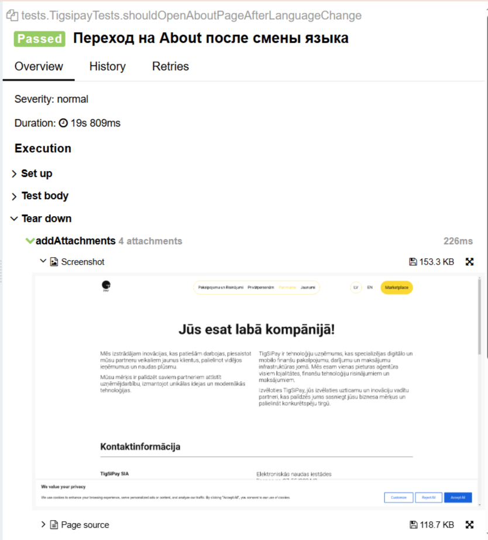
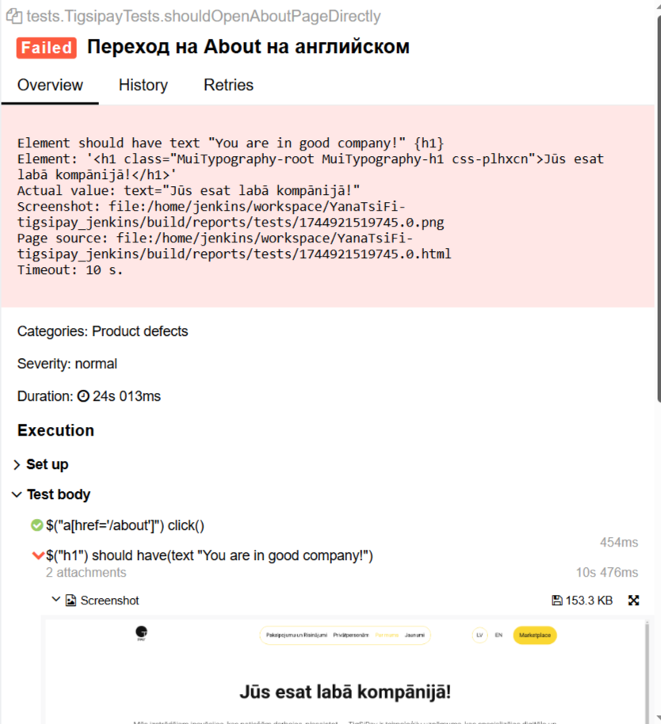
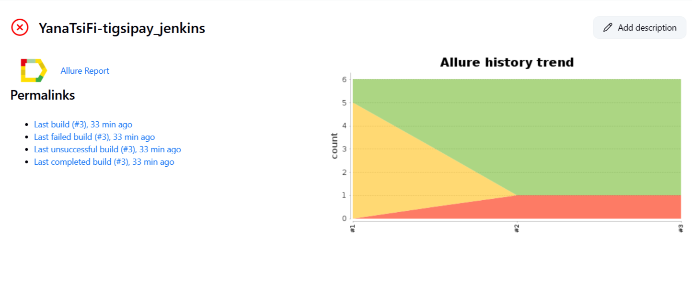

# UI Autotests for Tigsipay

Проект с автотестами на Selenide для сайта [https://tigsipay.com/en](https://tigsipay.com/en)

## 🔧 Технологии и инструменты

- Java
- Selenide
- JUnit 5
- Gradle
- Allure Report
- Jenkins
- Telegram Bot
- Selenoid

## 📁 Структура проекта

├src └─ test ├─ java │ ├─ tests (UI тесты) │ ├─ pages (PageObject классы) │ └─ testdata (тестовые данные) └─ resources └─ allure.properties

---

## ▶️ Запуск тестов

Локальный запуск:
gradle clean test

Удалённый запуск:
gradle clean test -Dremote=true

Запуск с параметрами:
-Dbrowser=chrome -Dversion=100 -Dsize=1920x1080

---

## 📊 Allure отчет

После прохождения тестов:
allure serve build/allure-results

<h3>✅ Примеры тестов</h3>

### Успешный тест:

### Упавший тест:

Процесс реализован в Jenkins и включает:

- ✅ Отчёт Allure
- ✅ Telegram-уведомления

### Скриншот пайплайна:

## 📬 Уведомления в Telegram

После каждой сборки Jenkins отправляется сообщение с результатами:
- статус сборки
- общее количество тестов
- количество упавших
- ссылка на Allure-отчёт

## 👤 Автор

Yana Tsifireva — QA Automation Engineer  
GitHub: [@YanaTsiFi](https://github.com/YanaTsiFi)

